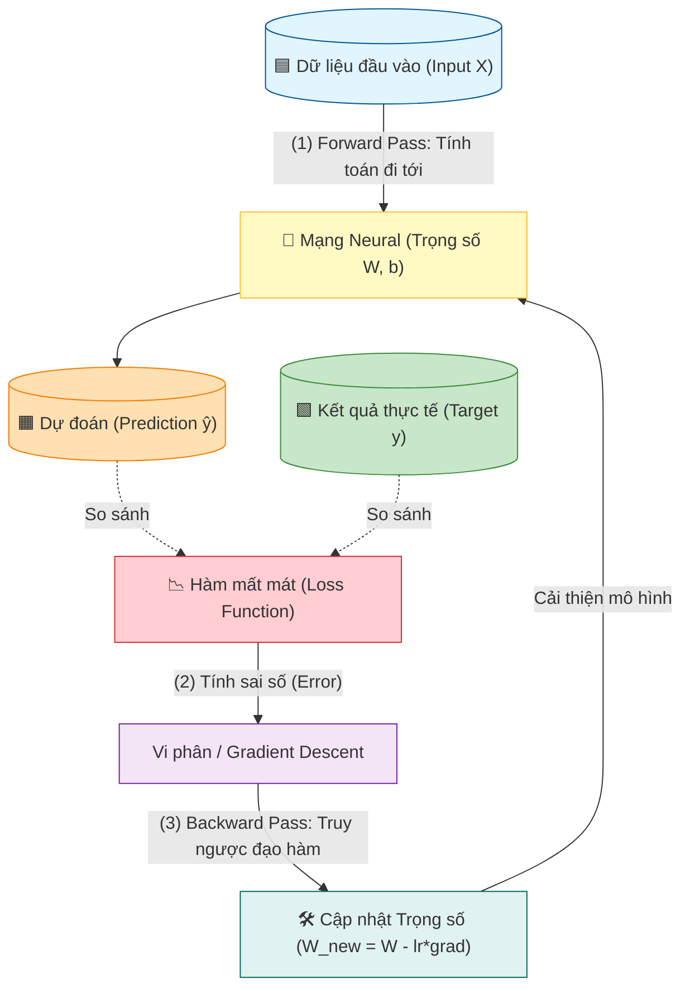

```mermaid
graph TD
    %% Định nghĩa các node
    Input[("🟦 Dữ liệu đầu vào (Input X)")]
    Model["🧠 Mạng Neural (Trọng số W, b)"]
    Pred[("🟧 Dự đoán (Prediction ŷ)")]
    Truth[("🟩 Kết quả thực tế (Target y)")]
    Loss["📉 Hàm mất mát (Loss Function)"]
    Grad["Vi phân / Gradient Descent"]
    Update["🛠️ Cập nhật Trọng số (W_new = W - lr*grad)"]

    %% Luồng Forward Pass
    Input -->|"(1) Forward Pass: Tính toán đi tới"| Model
    Model --> Pred
    Pred -.->|So sánh| Loss
    Truth -.->|So sánh| Loss

    %% Luồng Backward Pass
    Loss -->|"(2) Tính sai số (Error)"| Grad
    Grad -->|"(3) Backward Pass: Truy ngược đạo hàm"| Update
    Update -->|"Cải thiện mô hình"| Model

    %% Style
    style Input fill:#e1f5fe,stroke:#01579b
    style Model fill:#fff9c4,stroke:#fbc02d
    style Pred fill:#ffe0b2,stroke:#f57c00
    style Truth fill:#c8e6c9,stroke:#388e3c
    style Loss fill:#ffcdd2,stroke:#d32f2f
    style Grad fill:#f3e5f5,stroke:#7b1fa2
    style Update fill:#e0f2f1,stroke:#00695c
```